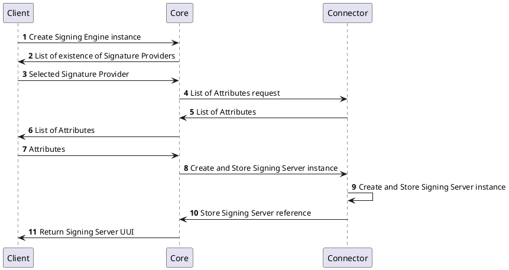
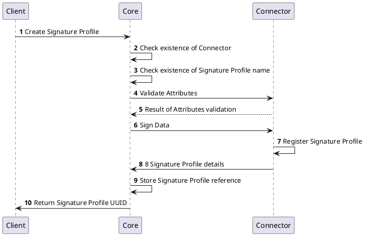
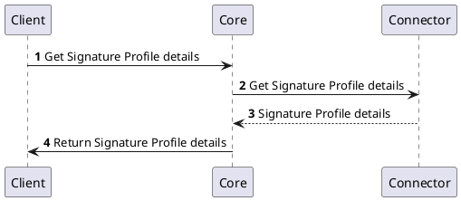
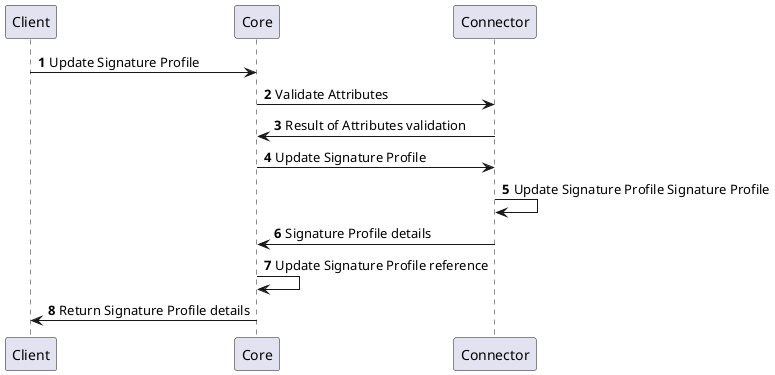
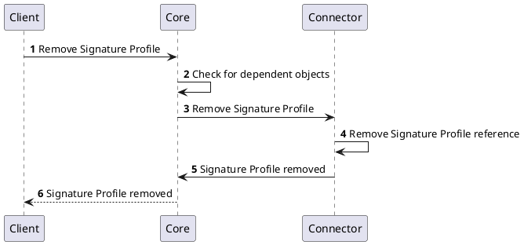
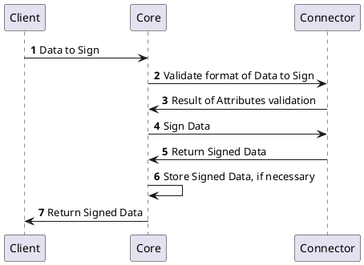

# Signature Provider

# Signing Engine Management

## Create Signing Engine instance

# Signature Porfile Management

## Create Signature Profile

## Get Signature Profile details

## Update Signature Profile

## Remove Signature Profile

# Signature Management

## Sign Data

## Table of `CORE` API

| Method | 	Name | Description |
| -------- | --------- | ---------------|
| `GET`| `listSignatureProfiles` | List all available (created) Signature Profiles, find in `core` database 
|`POST` |`createSignatureProfile` | Add new Signature Profile (only reference without Signature profile attributes) to `core` database

## Table of `Signature Provider` API

### Signing Engine Management

| Method | 	Name | Description |
| -------- | --------- | ---------------|
| `GET` | `listSigningServer` | list all created Signing Servers Instances (uuid, name, Signature Provider, attributes) from `connector` database
| `POST` |`createSigningServer` | add new Signing Server (name, Signature Provider, attributes) to `connector` database
| `GET` |`getSigningServerInstance` | get Signing Server Instance details (uuid, name, attributes) from `connector` database
| `POST` |`deleteSigningServerInstance` | delete Signing Server Instance (uuid, name, attributes) from `connector` database
| `POST` |`updateSigningServerInstance` | update Signing Server Instance (uuid, name, attributes) from `connector` database

### Signature Profile Management

| Method | 	Name | Description |
| -------- | --------- | ---------------|
| `GET` | `listSignatureProfiles` | list all created Signature Profiles (uuid, name, format, attributes) from `connector` database
| `POST` |`createSignatureProfile` | add new Signature Profile (name, format, attributes) to `connector` database
| `GET` |`getSignatureProfileInstance` | get Signature Profile (uuid, name, format, attributes) from `connector` database
| `POST` | `updateSignatureProfile` | update Signature Profile (name, format, attributes) in `connector` database
| `DELETE` |`removeSignatureProfileInstance` | remove Signature Profile Instance from `connector` database
| `GET` |`listSignatureProfileAttributes` | list Signature Profile Attributes (key restrictions, workers, ...)
| `POST` |`validateAttributes` |
| `GET` |`connectToSigningServer` |  connect to `Signing Server` address???

### Signature Management

| Method | 	Name | Description |
| -------- | --------- | ---------------|
|`POST` |`signData` | return signed data
|`GET` |`getSignatureAttributes` | return signature attributes specific for each connector (Czertainly Signing, SignServer, SEFIRA)

