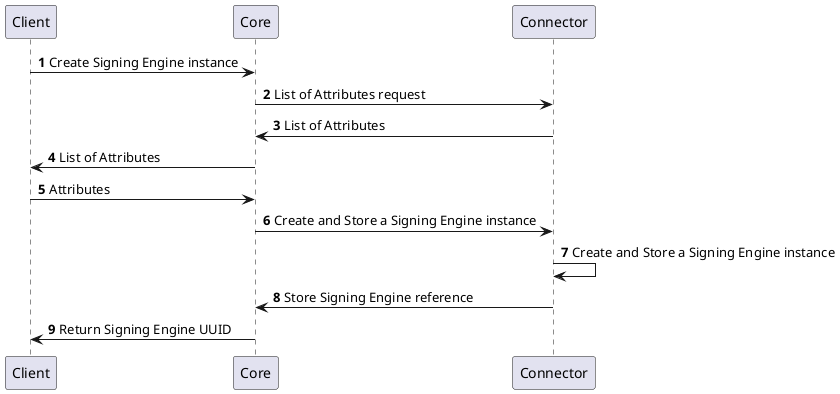
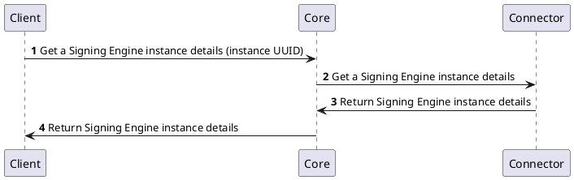
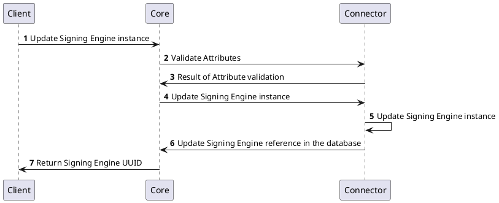
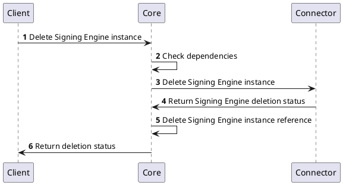
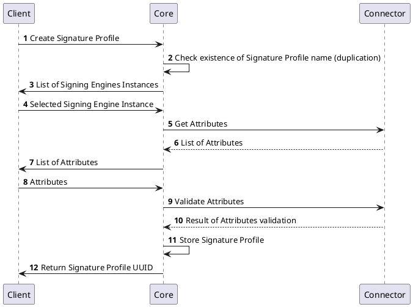
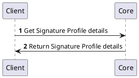
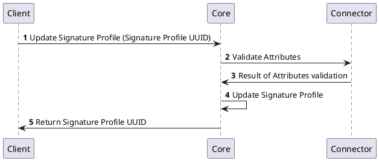
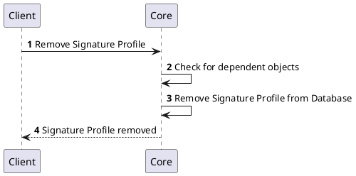
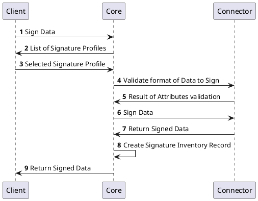
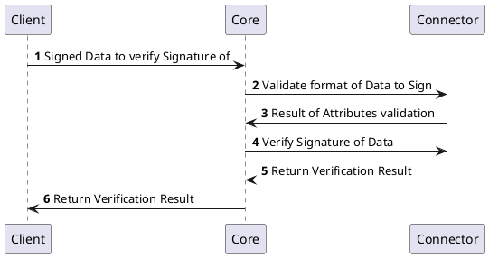

# Signature Provider

# Overview

Signature Provider provides a framework which allows an user to sign uploaded data and verify a signature of signed data.

# How it works

The Signature Provider offers the capability to communicate with various types of signature technologies.

For data signing, we can utilize either the technology implemented directly in Czertainly or connect to any other external technology that has its own signing implementation.

### Examples of Use Cases in CZERTAINLY Signture Provider

#### Use case - Sign data with a static private key

**Prerequisities:**
1. Optional - Generate and store key pair - by `Cryptographic Provider`, keys are stored in `Key Inventory` and issue a **Client Certificate** (corresponding to generated keys).
2. Connect one of **Signature Provider** connector.
3. Create a `Signature Profile` with the option **key restriction static private key enabled** (in the case of Czertainly Signing connector)

**Signing process**

1. User selects a **Signature Profile** enabling static private key signature. 
2. User uploads `Data to Sign`.
2. User selects an **existing/ new private key** - connect to `Key Inventory`/`Cryptographic provider`. 
 
4. User uploads new/existing certificate
   - upload the existing certificate (from external file, from `Certificate Inventory`).
   - generate a new certificate - **issuing certificate process** connect to `Authority Provider` 
   
5. If a **new Private Key** is selected -> the key is stored in `Key Inventory`, the certificate is stored in the `Certificate Inventory`.

6. As last step, user can select whether data should be signed immediately or stored in Signature Inventory and signed later. Regardless of the choice, a Signature Inventory entry will be created, containing a record of signing. 

### Use case - Sign data with a one-time private key
**OTS (One-time Signature)** 
- fast and cheap to compute signing and validation algorithms
- constructed from any one-way function
- we can the signing key only ONCE (otherwise the signature can be compromised)

**Prerequisities:** 
1. Connect one of **Signature Provider** connector 
2. Create a `Signature Profile` with the option **key restriction one-time signing private key enabled** (in the case of Czertainly Signing connector)

**Signing process**

1. User selects the **Signature profile** enabling one-time signing private key signature. 
2. User select the the **new private key** - connect to `Cryptographic Provider` the key will **NOT** be stored in `Key Inventory`
3. User requests CA to issue a new certificate - the cxertificate can be stored in Czertainly database.
4. As last step, user can select whether data should be signed immediately or stored in Signature Inventory and signed later. Regardless of the choice, a Signature Inventory entry will be created, containing a record of signing. 

# Provider objects

Generally, a similar approach is taken for Czertainly objects as with the Provider Authority. Two types of objects are introduced: `Signing Engine` and `Signature Profile`.

The `Signing Engine` stores access information related to the signing technology, such as the URL of the server where signing is performed and credentials allowing connection to the server. The specific information held by the `Signing Engine` depends on the implementation of the Signature Provider connector.

A `Signature Profile` comprises attributes that encapsulate all the common logic necessary for a specific signing use case. Each `Signature Profile` is associated with a `Signing Engine`.

As a result, Signature Profiles can be used by users and applEications consistently and conveniently. They simply select the appropriate Signature Profile, upload the data to sign, and Czertainly knows all the necessary configurations for performing the signature.

Signing process also compromises of storing `Signature Record` in Singnature Inventory, which is a part of Core database. Signing process will not always return signed data immediately, user can prepare signed data together with signature attributes for later signing (for example, signing will first need to be approved by administrator) and then the signed data can be retrieved from inventory. 

Attributes are important for Core to communicate with connector. The attributes are specific for each connector and they need to be defined for following:

### Signing Engine Attributes
Signing Engine attributes should allow acces to server where the signing will happen, so they will typically look like this:
 - Signing Engine URL
 - Credentials

### Signature Profile Attributes
Each Signature Profile attributes contain settings which will be common for all signatures created using the Signature Profile, which could be:
- **Format** of data to sign: **PDF, XML, CODE, JSON**  
- **SIGNATURE_LEVEL**: **PAdES-Baseline-B,...**
- **signing certificate attributes**, **CA certificate requirement**
- **key restrictions**
	 - enable `one-time signing/ static private key/ both` 
	 - **key length**
   - **key type**
- **DIGEST ALGORITHM** : SHA256

### Signing Processs Attributes
Each Signing Process has attributes contain settings for a specific signature instance, such as:
- **signing key** (based on Signature Profile configuration):
    - **existing key** - for signature with **static private key**
    - **generate a new key** - for **one time signing** or **static private key**

# Processes

The following processes are associated with the Signature Provider. 

We consider three processes areas:
    - Signing Engine Management
    - Signature Profile Management
    - Signature Management

# Signing Engine Management

### Create Signing Engine instance

### Get Signing Engine instance details

### Update Signing Engine instance

### Delete Signing Engine instance

# Signature Profile Management

### Create Signature Profile

### Get Signature Profile details

### Update Signature Profile

### Remove Signature Profile

# Signature Management

### Sign Data

### Verify Signature of Signed Data

## Table of `CORE` API

The following tables summarize the APIs that are implemented for communication with the core.

### Signing Engine Management

| Method | 	Name | Description |
| -------- | --------- | ---------------|
| `GET` | `listSigningEngineInstances` | list all created Signing Engine Instances (uuid, name, Signature Provider, attributes) from `core` database
| `POST` |`createSigningEngineInstance` | add new Signing Engine (name, Signature Provider, attributes) to `core` database
| `GET` |`getSigningEngineInstance` | get Signing Engine Instance details (uuid, name, attributes) from `core` database
| `POST` |`deleteSigninEngineInstance` | delete Signing Engine Instance (uuid, name, attributes) from `core` database
| `POST` |`updateSigningEngineInstance` | update Signing Engine Instance (uuid, name, attributes) from `core` database

### Signature Profile Management

| Method | 	Name | Description |
| -------- | --------- | ---------------|
| `GET` | `listSignatureProfiles` | list all created Signature Profiles (uuid, name, format, attributes) from `connector` database
| `POST` |`createSignatureProfile` | add new Signature Profile (name, format, attributes) to `connector` database
| `GET` |`getSignatureProfileInstance` | get Signature Profile (uuid, name, format, attributes) from `connector` database
| `POST` | `updateSignatureProfile` | update Signature Profile (name, format, attributes) in `connector` database
| `DELETE` |`removeSignatureProfileInstance` | remove Signature Profile Instance from `connector` database
| `GET` |`listSignatureProfileAttributes` | list Signature Profile Attributes (key restrictions, workers, ...)
| `POST` |`validateAttributes` |

### Client Signature Management

| Method | 	Name | Description |
| -------- | --------- | ---------------|
|`POST` |`signData` | return signed data
|`POST` |`verifySignature` | verify Signature of signed data

## Table of `Signature Provider` API

The following tables summarize the APIs that are implemented for communication with the `Signature Provider` connector.

### Signing Engine Management

| Method | 	Name | Description |
| -------- | --------- | ---------------|
| `GET` | `listSigningEngineInstances` | list all created Signing Engine Instances (uuid, name, Signature Provider, attributes) from `connector` database
| `POST` |`createSigningEngineInstance` | add new Signing Engine (name, Signature Provider, attributes) to `connector` database
| `GET` |`getSigningEngineInstance` | get Signing Engine Instance details (uuid, name, attributes) from `connector` database
| `POST` |`deleteSigninEngineInstance` | delete Signing Engine Instance (uuid, name, attributes) from `connector` database
| `POST` |`updateSigningEngineInstance` | update Signing Engine Instance (uuid, name, attributes) from `connector` database

### Signature Management

| Method | 	Name | Description |
| -------- | --------- | ---------------|
|`POST` |`signData` | return signed data
|`POST` |`verifySignature` | verify Signature of signed data

