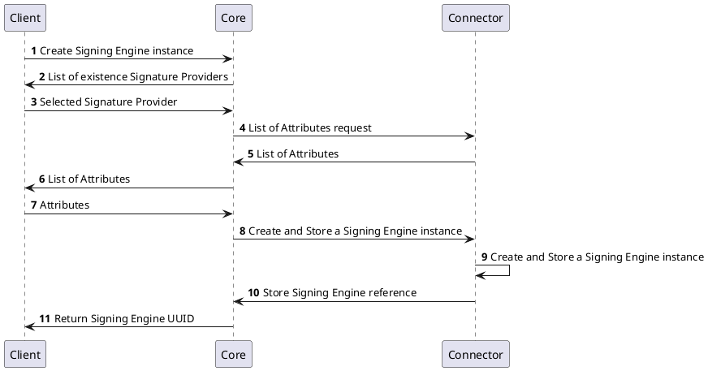
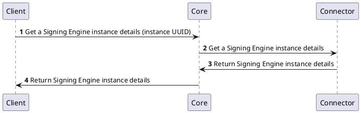
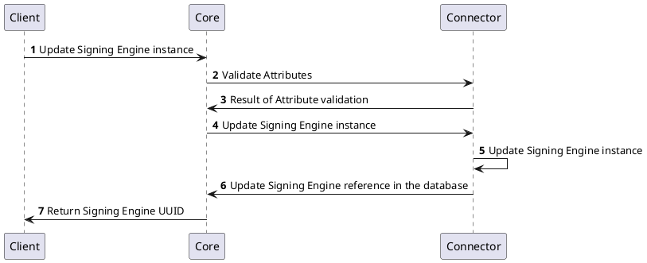
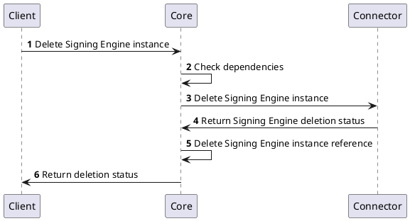
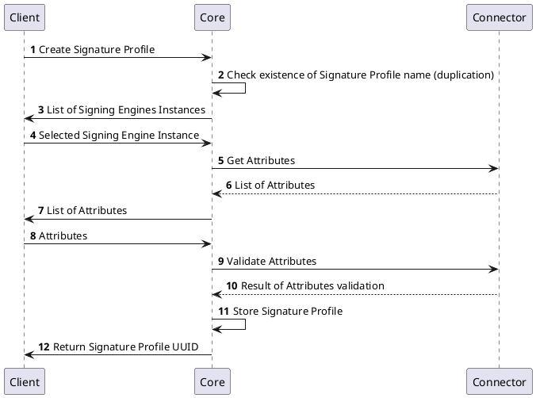
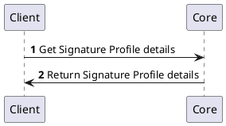
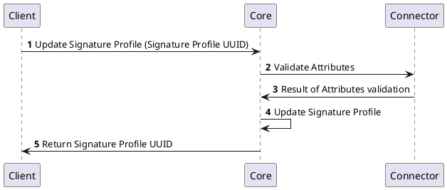
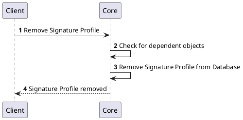
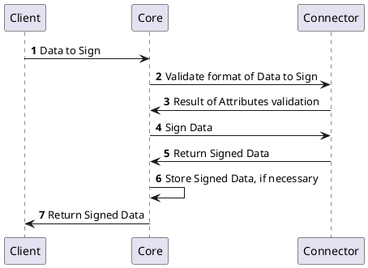
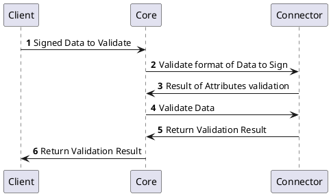

# Signature Provider

# Overview
Signature Provider provides a framework which allows a user to sign uploaded data and verify signed data.
# How it works
To sign data, user must first create two entities - `Signing Engine` and `SignatureProfile`.
`Signing Engine` handles connection to signing server, ... 
`Signature Profile` uses `Signing Engine` and contains all logic commnon for a certain signing use case. For example, a Signature Profile 

# Provider objects

# Processes

### Signing Engine Management

| Method | 	Name | Description |
| -------- | --------- | ---------------|
| `GET` | `listSigningEngineInstances` | list all created Signing Engine Instances (uuid, name, Signature Provider, attributes) from `connector` database
| `POST` |`createSigningEngineInstance` | add new Signing Engine (name, Signature Provider, attributes) to `connector` database
| `GET` |`getSigningEngineInstance` | get Signing Engine Instance details (uuid, name, attributes) from `connector` database
| `DELETE` |`deleteSigninEngineInstance` | delete Signing Engine Instance (uuid, name, attributes) from `connector` database
| `PUT` |`updateSigningEngineInstance` | update Signing Engine Instance (uuid, name, attributes) from `connector` database

### Create Signing Engine instance

### Get Signing Engine instance details

### Update Signing Engine instance

### Delete Signing Engine instance

# Signature Profile Management

| Method | 	Name | Description |
| -------- | --------- | ---------------|
| `GET` | `listSignatureProfiles` | list all created Signature Profiles (uuid, name, format, attributes) from `connector` database
| `POST` |`createSignatureProfile` | add new Signature Profile (name, format, attributes) to `connector` database
| `GET` |`getSignatureProfileDetails` | get Signature Profile (uuid, name, format, attributes) from `connector` database
| `PUT` | `updateSignatureProfile` | update Signature Profile (name, format, attributes) in `connector` database
| `DELETE` |`removeSignatureProfile` | remove Signature Profile Instance from `connector` database
| `GET` |`listSignatureProfileAttributes` | list Signature Profile Attributes (key restrictions, workers, ...)
| `POST` |`validateSignatureProfileAttributes` |....
| `GET` |`connectToSigningEngine` |  connect to `Signing Engine` address???

### Create Signature Profile

### Get Signature Profile details

### Update Signature Profile

### Remove Signature Profile

# Signature Management

### Sign Data

### Validate Signed Data

## Table of `CORE` API

| Method | 	Name | Description |
| -------- | --------- | ---------------|
| `GET`| `listSignatureProfiles` | List all available (created) Signature Profiles, find in `core` database 
|`POST` |`createSignatureProfile` | Add new Signature Profile (only reference without Signature profile attributes) to `core` database

## Table of `Signature Provider` API

### Signing Engine Management

| Method | 	Name | Description |
| -------- | --------- | ---------------|
| `GET` | `listSigningEngineInstances` | list all created Signing Engine Instances (uuid, name, Signature Provider, attributes) from `connector` database
| `POST` |`createSigningEngineInstance` | add new Signing Engine (name, Signature Provider, attributes) to `connector` database
| `GET` |`getSigningEngineInstance` | get Signing Engine Instance details (uuid, name, attributes) from `connector` database
| `POST` |`deleteSigninEngineInstance` | delete Signing Engine Instance (uuid, name, attributes) from `connector` database
| `POST` |`updateSigningEngineInstance` | update Signing Engine Instance (uuid, name, attributes) from `connector` database

### Signature Profile Management

| Method | 	Name | Description |
| -------- | --------- | ---------------|
| `GET` | `listSignatureProfiles` | list all created Signature Profiles (uuid, name, format, attributes) from `connector` database
| `POST` |`createSignatureProfile` | add new Signature Profile (name, format, attributes) to `connector` database
| `GET` |`getSignatureProfileInstance` | get Signature Profile (uuid, name, format, attributes) from `connector` database
| `POST` | `updateSignatureProfile` | update Signature Profile (name, format, attributes) in `connector` database
| `DELETE` |`removeSignatureProfileInstance` | remove Signature Profile Instance from `connector` database
| `GET` |`listSignatureProfileAttributes` | list Signature Profile Attributes (key restrictions, workers, ...)
| `POST` |`validateAttributes` |
| `GET` |`connectToSigningServer` |  connect to `Signing Server` address???

### Signature Management

| Method | 	Name | Description |
| -------- | --------- | ---------------|
|`POST` |`signData` | return signed data
|`GET` |`getSignatureAttributes` | return signature attributes specific for each connector

